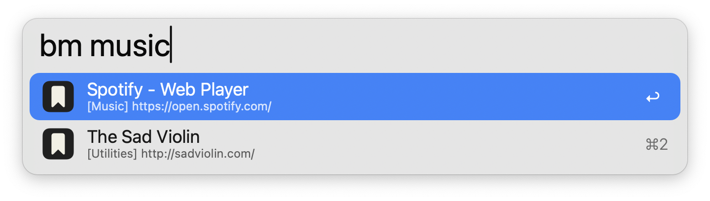

#  Zen Bookmarks

Search Zen bookmarks in Alfred

## Setup

This workflow requires [jq](https://jqlang.github.io/jq/) to function, which now comes preinstalled on macOS Sequoia 15.0.0 and later.

## Usage

Search for your [Zen](https://zen-browser.app/) bookmarks using the `bm` keyword.

Type to refine your search. Bookmarks are always filtered by Name, while filtering by URL, Tags, Keyword, and bookmark description are configurable from the [Workflow’s Configuration](https://www.alfredapp.com/help/workflows/user-configuration/).

* <kbd>↩</kbd> Open bookmark in primary browser
* <kbd>⇧</kbd><kbd>⌘</kbd><kbd>↩</kbd> Open in primary browser without closing Alfred (when browser is in focus)
* <kbd>⌘</kbd><kbd>↩</kbd> Open bookmark in secondary browser
* <kbd>⌘</kbd><kbd>C</kbd> Copy bookmark URL
* <kbd>⌘</kbd><kbd>L</kbd> View all tags and full URL in Large Type
* <kbd>⇧</kbd> Hold to show bookmark description

The Zen Twilight build is also supported and [configurable](https://www.alfredapp.com/help/workflows/user-configuration/). The Workflow's icon colours and bookmarks will change based on the selected Release Channel.

Append `::` to the configured [Keyword](https://www.alfredapp.com/help/workflows/inputs/keyword) to access other actions, including opening the [Zen Profile Manager](https://support.mozilla.org/kb/profile-manager-create-remove-switch-firefox-profiles). Bookmarks are only indexed from the default profile, which can be changed from the Profile Manager in each Zen build.

Configure the [Hotkey](https://www.alfredapp.com/help/workflows/triggers/hotkey/) as a shortcut to search for your bookmarks.

Bookmarks with the tag `Exclude-Alfred` will be hidden from search. This tag is case sensitive.

**Note**: Due to a limitation of Firefox (which Zen is based on), bookmark changes may take time to appear in Alfred. Restarting Zen will make all changes appear immediately.